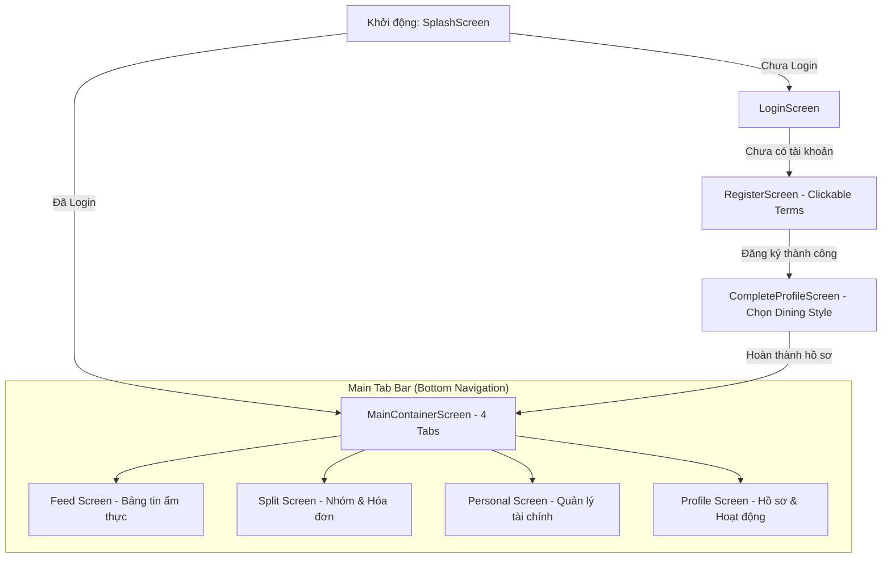

# 🍽️ DineSplit — Social Dining & Smart Expense Manager

[](https://kotlinlang.org)
[](https://developer.android.com/jetpack/compose)
[](https://firebase.google.com)
[](https://developer.android.com/topic/architecture)

**DineSplit** là một ứng dụng Android hiện đại, được tối ưu hóa cho trải nghiệm di động (**Mobile-First**), phát triển hoàn toàn bằng **Jetpack Compose** cùng hệ sinh thái **Firebase (Auth, Firestore, Storage, Cloud Messaging)**. 

Dự án là sự kết hợp độc đáo giữa **Mạng xã hội ẩm thực (Social Dining)** và **Trình chia sẻ hóa đơn nhóm thông minh (Smart Split Billing)** kèm theo **Quản lý tài chính cá nhân (Personal Ledger)**. DineSplit giải quyết triệt để bài toán: kết nối những tâm hồn ăn uống, chia sẻ khoảnh khắc ẩm thực thực tế, tự động hóa việc tính toán chia nợ nhóm sòng phẳng và quản lý dòng tiền chi tiêu cá nhân một cách thông thái.

---

## 🗺️ Luồng Đi & Trải Nghiệm Người Dùng (User Flows)

Ứng dụng được tổ chức xung quanh 4 Bottom Navigation Tabs chính bên trong hệ khung Scaffold nhất quán:



---

## 💎 Các Phân Phẩm Tính Năng Cốt Lõi (Key Features)

### 👤 1. Hệ Thống Nền Tảng, Auth & Hồ Sơ (Person A - Foundation Owner)
*   **Hệ thống phiên làm việc (Session Check & Splash):** Kiểm tra trạng thái đăng nhập thời gian thực. Tự động chuyển hướng giữa luồng khách và luồng chính mà không giật lag.
*   **Đăng ký & Xác thực thông minh:** Quy trình đăng ký tích hợp **Điều khoản dịch vụ Clickable Terms** (sử dụng `ClickableText` và `LocalUriHandler` để dẫn sang trang ngoài). Kiểm soát hộp chọn chấp thuận điều khoản bảo mật trước khi submit.
*   **Hoàn thiện Hồ sơ & Tùy chọn Ẩm thực (Dining Style Chips):** Người dùng chọn các nhãn phong cách ăn uống ưa thích (*Fine Dining, Cafe Hopper, Nightlife, Street Food, Home Chef, Sweet Tooth*). Hệ thống lưu động dưới dạng danh sách mảng trên Firestore để các phân hệ khác khai thác.
*   **Cập nhật Thông tin Cá nhân:** Trang chỉnh sửa hồ sơ mượt mà, hỗ trợ sửa đổi Bio, Display Name, đồng bộ hóa lập tức với giao diện chính.

### 🍽️ 2. Mạng Xã Hội Ẩm Thực (Person B - Social Feed Owner)
*   **Bảng tin Ẩm thực năng động (Feed list):** Hiển thị danh sách bài chia sẻ từ bạn bè với ảnh chụp, địa chỉ ăn uống và ghi chú đánh giá.
*   **Tương tác Bài viết:** Thao tác thích bài đăng (Heart Toggles) và phần bình luận (Comments) hoạt động trực tiếp thời gian thực, lưu trữ trên Firestore.
*   **Khám phá ẩm thực (Search Bar):** Tìm kiếm bài đăng, địa điểm ăn uống hoặc kết nối trực tiếp với người dùng khác qua Username.
*   **Hồ sơ Công khai (Other User Profile):** Cho phép xem thông tin, số lượng bài đăng, số người theo dõi (followers/following) và lưới ảnh hoạt động ẩm thực của thành viên khác.

### 💰 3. Trình Chia Tiền Nhóm & Smart Split Engine (Person D - Split Owner)
*   **Quản lý Nhóm Linh hoạt:** Tạo nhóm ăn uống (Ăn trưa văn phòng, Du lịch cuối tuần...), mời thành viên và đặt ảnh đại diện nhóm.
*   **Tạo Hóa Đơn Phân Loại Chi Tiết (Create Bill):**
    *   *Chia đều (Equal Split):* Chia tự động bằng nhau cho tất cả thành viên trong nhóm.
    *   *Chia tùy chọn (Custom Split):* Gán số tiền cụ thể riêng lẻ cho từng người.
    *   *Chia theo món (Itemized Split Baseline):* Nhập chi tiết từng món ăn và tích chọn chính xác thành viên nào tham gia món đó để tính tiền cực kỳ công bằng.
*   **Theo Dõi Thanh Toán (Payment Status):** Xem rõ ai đã trả tiền, ai chưa trả và những ai mới thanh toán một phần (Paid / Unpaid / Partial).
*   **Động Cơ Quyết Toán Tối Ưu (Smart Split Engine):** Thuật toán tự động thu gọn các khoản nợ chéo trong nhóm, tính toán ra số tiền Net Balance (Thực thu/Thực trả) tối thiểu để các thành viên settle tiền nhanh chóng và ít giao dịch nhất.

### 📈 4. Quản Lý Tài Chính & Radar Chi Tiêu (Person C - Personal Finance Owner)
*   **Giao dịch & Danh mục chi tiêu (Personal Ledger):** Ghi chép thu chi hàng ngày dễ dàng, phân loại theo các danh mục nhà hàng, cà phê, bar/pub...
*   **Biểu Đồ Xu Hướng Chi Tiêu:** Biểu đồ hình tròn (Pie Chart) và biểu đồ cột (Bar Chart) tự vẽ động để biểu thị tỷ lệ tiền đã tiêu theo tuần/tháng.
*   **Smart Monthly Insights & Safe-to-Spend:** Đưa ra dự báo số tiền tối đa có thể chi tiêu an toàn mỗi ngày dựa trên quỹ tiền còn lại và mục tiêu tiết kiệm đã cài đặt.
*   **Split-to-Personal Bridge (Cầu nối liên thông):** Khi người dùng thanh toán hóa đơn nhóm ở phân hệ Split, hệ thống sẽ tự động hiển thị gợi ý (Bottom Sheet) hỏi xem có muốn ghi nhận khoản tiền đó vào sổ tài chính cá nhân ở phân hệ Personal không ➔ Giúp dữ liệu đồng nhất không cần nhập tay lại.
*   **Chỉ số sức khỏe tài chính (Financial Health Score):** Đánh giá điểm từ 0-100 dựa trên phân tích dòng tiền để cảnh báo hành vi mua sắm.

### 🔔 5. Hộp Thông Báo & Tương Tác Sâu (Notification & Deep Linking)
*   **Trung tâm thông báo (Notification Center):** Nơi nhận các thông báo nhắc nợ từ nhóm Split, thông báo lượt thích/bình luận mới từ mạng xã hội Feed.
*   **Deep Link Phản Hồi Nhanh:** Khi người dùng click vào thông báo, ứng dụng tự động phân tích đường link và mở đúng màn hình mục tiêu liên quan (Ví dụ: Click báo nợ ➔ Chuyển ngay đến màn hình quyết toán của nhóm Split đó).

---

## 🛠️ Stack Công Nghệ & Thư Viện Sử Dụng (Tech Stack)

*   **Ngôn ngữ:** Kotlin 1.9.x (Modern Kotlin & Coroutines / Flows).
*   **Giao diện:** Jetpack Compose (Material Design 3 - M3).
*   **Di trú luồng dữ liệu:** Jetpack Navigation Compose (Type-Safe Routes).
*   **Quản trị trạng thái:** ViewModel, StateFlow, Livedata, Compose Runtime State.
*   **Hạ tầng đám mây (Cloud Backend):** 
    *   *Firebase Authentication:* Đăng nhập & Đăng ký an toàn.
    *   *Cloud Firestore:* Cơ sở dữ liệu NoSQL đồng bộ thời gian thực cho Bài đăng, Nhóm, Hóa đơn và Tài chính.
    *   *Firebase Storage:* Lưu trữ hình ảnh bài đăng, avatar nhóm và hóa đơn.
    *   *Firebase Cloud Messaging (FCM):* Đẩy thông báo đẩy thời gian thực.
*   **Dependency Injection:** Dagger Hilt (Quản lý các module dependencies biên dịch an toàn).
*   **Tải hình ảnh:** Coil Compose (Load ảnh bất đồng bộ kèm bộ đệm thông minh).
*   **ML Kit (Text Recognition):** Hỗ trợ nhận diện chữ viết hóa đơn để xử lý nhanh (OCR).

---

## 🏗️ Kiến Trúc Mã Nguồn (Architecture & Directory Structure)

Dự án tuân thủ nghiêm ngặt **Kiến trúc Clean Architecture** tinh giản kết hợp mô hình **MVVM (Model-View-ViewModel)** để phân tách độc lập mã nguồn giao diện, nghiệp vụ và tích hợp dữ liệu:

```
DineSplit/
├── app/
│   ├── src/
│   │   ├── main/
│   │   │   ├── java/com/example/dinesplit/
│   │   │   │   ├── core/             # Lớp Tiện ích, Hằng số & Cấu hình nền tảng
│   │   │   │   ├── di/               # Hilt Dependency Injection Modules (AppModule, RepositoryModule)
│   │   │   │   ├── domain/           # LAYER NGHIỆP VỤ (Hợp đồng & Logic thuần túy Kotlin)
│   │   │   │   │   ├── model/          # Các thực thể dữ liệu (UserProfile, Group, Bill, Post...)
│   │   │   │   │   ├── repository/     # Giao diện kết nối dữ liệu (AuthRepository, SplitRepository...)
│   │   │   │   │   └── usecase/        # Ca sử dụng chi tiết (LoginUseCase, SavePostUseCase, CalculateSplitUseCase)
│   │   │   │   ├── data/             # LAYER DỮ LIỆU (Tích hợp Firebase, Remote & Map dữ liệu)
│   │   │   │   │   ├── repository/     # Triển khai các repositories (FirebaseProfileRepository, FirebaseSplitRepository...)
│   │   │   │   │   ├── seeder/         # Trình sinh dữ liệu chạy thử mẫu (DemoDataSeeder)
│   │   │   │   │   └── mapper/         # Chuyển đổi qua lại giữa Model Firestore và Model Domain
│   │   │   │   ├── presentation/     # LAYER GIAO DIỆN (Jetpack Compose UI & State Management)
│   │   │   │   │   ├── components/     # Các thành phần giao diện dùng chung (ErrorStateBlock, LoadingBlock...)
│   │   │   │   │   ├── auth/           # Màn hình Login, Register, CompleteProfile và ViewModels
│   │   │   │   │   ├── main/           # MainContainerScreen chứa Bottom Navigation chính của app
│   │   │   │   │   ├── feed/           # Mạng xã hội ẩm thực (Bảng tin, Tìm kiếm, Tạo bài viết)
│   │   │   │   │   ├── split/          # Tạo nhóm, Tạo hóa đơn, Danh sách hóa đơn, Quyết toán nợ
│   │   │   │   │   ├── personal/       # Ghi chép tài chính cá nhân, Insights, Biểu đồ chi tiêu
│   │   │   │   │   └── profile/        # Quản lý hồ sơ cá nhân của tôi & xem hồ sơ người khác
│   │   │   │   └── MainActivity.kt   # App Entry Point (Điểm khởi đầu của ứng dụng)
│   │   │   ├── res/                # Tài nguyên đồ họa, Vector, Màu sắc, String XML
│   │   │   └── AndroidManifest.xml # Cấu hình quyền truy cập (Internet, Cam...)
│   │   └── test/                   # Kiểm thử logic nghiệp vụ (Unit Tests)
```

---

## 📓 Bản Đồ Tài Liệu Phát Triển (Clickable Docs Map)

Nếu bạn là thành viên trong nhóm phát triển hoặc giảng viên muốn xem chi tiết thiết kế kỹ thuật, hãy truy cập trực tiếp các tài liệu chuyên sâu đặt tại thư mục [docs/](file:///e:/PKI/DineSplit/docs):

### 1. Tài liệu Kế hoạch Tích hợp & Quy hoạch
*   🔗 **[00_file_chung_4_tuan_cuoi_dinesplit.md](file:///e:/PKI/DineSplit/docs/00_file_chung_4_tuan_cuoi_dinesplit/00_file_chung_4_tuan_cuoi_dinesplit.md)** — Kế hoạch tổng lực 4 tuần cuối, ranh giới bàn giao, tiêu chuẩn Definition of Done và kịch bản demo tổng hợp toàn app.
*   🔗 **[UX_IMPLEMENTATION_GUIDE.md](file:///e:/PKI/DineSplit/docs/UX_IMPLEMENTATION_GUIDE.md)** — Cẩm nang thiết kế UI/UX đồng bộ: cấu trúc HSL màu sắc sang trọng, khoảng cách, xử lý bất đồng bộ, thông báo lỗi và các mẫu giao diện rỗng (Empty State).
*   🔗 **[PERSONAL_FEATURES_AND_UI_ROADMAP.md](file:///e:/PKI/DineSplit/docs/PERSONAL_FEATURES_AND_UI_ROADMAP.md)** — Lộ trình nâng cấp giao diện nhất quán cho 4 Bottom Tabs và thiết kế dữ liệu liên thông.

### 2. Kế hoạch Chi tiết Của Từng Thành Viên (4 Tuần Cuối)
*   👤 **[Tài liệu bàn giao Người A - Foundation, Auth & Profile](file:///e:/PKI/DineSplit/docs/00_file_chung_4_tuan_cuoi_dinesplit/A_4_tuan_cuoi.md)** — Hướng dẫn cụ thể xem chi tiết [README-A.md](file:///e:/PKI/DineSplit/docs/README-A.md).
*   👤 **[Tài liệu bàn giao Người B - Feed Social](file:///e:/PKI/DineSplit/docs/00_file_chung_4_tuan_cuoi_dinesplit/B_4_tuan_cuoi.md)** — Hoàn thiện nghiệp vụ mạng xã hội từ giao diện mock lên data thật.
*   👤 **[Tài liệu bàn giao Người C - Personal Finance & Notification](file:///e:/PKI/DineSplit/docs/00_file_chung_4_tuan_cuoi_dinesplit/C_4_tuan_cuoi.md)** — Hoàn thiện quản lý dòng tiền cá nhân và trung tâm thông báo.
*   👤 **[Tài liệu bàn giao Người D - Smart Split Billing](file:///e:/PKI/DineSplit/docs/00_file_chung_4_tuan_cuoi_dinesplit/D_4_tuan_cuoi.md)** — Xây dựng động cơ tính toán và quyết toán nợ nhóm tối ưu.

---

## 🚀 Hướng Dẫn Thiết Lập Nhanh (Getting Started)

### 1. Cài đặt Firebase Backend
Để kết nối cơ sở dữ liệu và xác thực, bạn cần thực hiện:
1.  Truy cập [Firebase Console](https://console.firebase.google.com/).
2.  Tạo một Project Android mới với tên gói ứng dụng: `com.example.dinesplit`.
3.  Tải xuống tệp tin `google-services.json` rồi đặt vào thư mục [app/](file:///e:/PKI/DineSplit/app).
4.  Kích hoạt các dịch vụ sau trong bảng điều khiển Firebase:
    *   **Firebase Authentication:** Bật phương thức đăng nhập bằng *Email/Password*.
    *   **Cloud Firestore Database:** Khởi tạo dữ liệu (chọn chế độ Test Mode hoặc áp dụng file phân quyền bảo mật [firestore.rules](file:///e:/PKI/DineSplit/firestore.rules)).
    *   **Firebase Storage:** Khởi tạo lưu trữ hình ảnh tải lên.

### 2. Nạp Dữ Liệu Chạy Thử Mẫu (Demo Data)
Hệ thống tích hợp sẵn lớp nạp dữ liệu mẫu tự động `DemoDataSeeder` tại [data/seeder/](file:///e:/PKI/DineSplit/app/src/main/java/com/example/dinesplit/data/seeder/DemoDataSeeder.kt). 
Khi khởi động ứng dụng lần đầu ở chế độ debug, hệ thống sẽ tự động kiểm tra và sinh sẵn các nhóm ăn uống, hóa đơn mẫu, bài viết và tài chính mẫu trên Firestore để đội ngũ phát triển có dữ liệu chạy thử ngay lập tức mà không cần nhập tay từ đầu.

---

## 💻 Các Lệnh Hữu Ích & Cách Xử Lý Lỗi Biên Dịch (Gradle Scripts)

### 1. Xóa thư mục tạm & biên dịch ứng dụng
```bash
./gradlew assembleDebug
```

### 2. Cài đặt ứng dụng trực tiếp lên máy ảo / thiết bị thật
```bash
./gradlew installDebug
```

### 3. Chạy Unit Tests kiểm thử logic
```bash
./gradlew testDebugUnitTest
```

### 🚨 Lưu ý cực kỳ quan trọng cho các lập trình viên sử dụng Windows:
Trong môi trường Windows, trình biên dịch Kotlin đôi khi khóa các tập tin trong bộ đệm khi biên dịch liên tục, dẫn đến lỗi phổ biến:
> `java.lang.AssertionError: Could not close incremental caches in E:\PKI\DineSplit\app\build\...`

**Giải pháp khắc phục triệt để:** Không chạy Gradle daemon ngầm và thực hiện dọn dẹp bộ đệm bằng lệnh:
```powershell
.\gradlew.bat clean compileDebugKotlin --no-daemon
```

---

## 🤝 Chuẩn Phát Triển & Bàn Giao Nhóm

*   **Tách nhánh tính năng:** Mọi tính năng mới đều được làm trên nhánh phụ `feature/A-*`, `feature/B-*`... trước khi tích hợp vào nhánh phát triển chung `dev`. Nhánh `main` chỉ chứa mã nguồn hoàn chỉnh không có lỗi biên dịch.
*   **Thống nhất UI Components:** Sử dụng các thành phần giao diện nhất quán đã thiết lập trong `presentation/components` (như cách xử lý trạng thái Loading xoay tròn, thông báo Lỗi kèm nút Retry thử lại) để tránh mỗi phân hệ có một style giao diện khác nhau.

---

*Chúc toàn đội hoàn thành một sản phẩm công nghệ DineSplit xuất sắc, mang lại giá trị thực tế cao và bảo vệ đồ án thành công tốt đẹp!* 🎉
