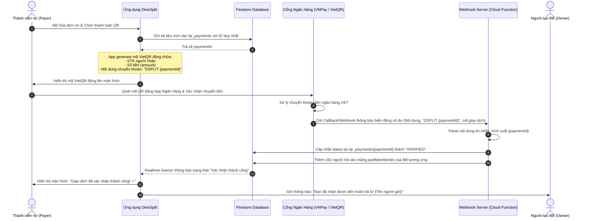

# DineSplit — Firestore Database Schema (Cập nhật toàn diện & Đồng bộ Thực tế)

Tài liệu này đặc tả chi tiết cấu trúc các collection và document của Firestore được đồng bộ chính xác với mã nguồn ứng dụng DineSplit và mô hình tích hợp thanh toán QR VNPay-style tự động.

---

## 🏗️ Kiến Trúc Tổng Thể

```
Firebase Firestore:
├── users/                     → Thông tin người dùng
├── usernames/                 → Registry duy nhất của username
├── posts/                     → Bảng tin ẩm thực mạng xã hội
│   └── sub: comments/         → Bình luận dưới bài viết
├── groups/                    → Nhóm chia tiền (Split Bill)
│   ├── sub: members/          → Chi tiết thành viên trong nhóm
│   └── sub: bills/            → Danh sách hóa đơn trong nhóm
├── user_notifications/        → Hòm thư thông báo của từng người dùng
│   └── sub: notifications/    → Danh sách thông báo
├── user_personal/             → Quản lý tài chính cá nhân (Personal Module)
│   ├── sub: transactions/     → Các giao dịch thu chi cá nhân
│   ├── sub: categories/       → Danh mục thu chi (mặc định + tự tạo)
│   ├── sub: wallets/          → Ví tài khoản (Tiền mặt, ngân hàng...)
│   ├── sub: goals/            → Mục tiêu tiết kiệm
│   ├── sub: reminders/        → Ngân sách cảnh báo chi tiêu
│   └── sub: recurring_rules/  → Hóa đơn định kỳ (Netflix, điện nước...)
└── qr_payments/               → Giao dịch thanh toán QR (VNPay-style webhook)
```

---

## 💾 Đặc tả Chi tiết Collections & Documents

### 1. `users` — Hồ sơ người dùng
* **Path**: `/users/{uid}`
* **Schema**:
```json
{
  "uid": "string",
  "displayName": "string",
  "username": "string",
  "usernameLower": "string",       // [BẮT BUỘC] lowercase để truy vấn tìm kiếm
  "email": "string",
  "avatarUrl": "string",
  "bio": "string",
  "diningStyles": ["string"],      // Ví dụ: ["Street Food", "Cafe Hopper"]
  "followersCount": 0,
  "followingCount": 0,
  "postsCount": 0,
  "fcmToken": "string",            // Token nhận tin báo Firebase Cloud Messaging
  "savedPostIds": ["string"],      // Danh sách ID bài đăng đã bookmark
  "followingIds": ["string"],      // Danh sách UID đang theo dõi (để tìm kiếm bạn bè nhanh)
  "followerIds": ["string"],       // Danh sách UID đang theo dõi lại (follow ngược)
  "isPublic": true,                // Chế độ công khai tài khoản
  "createdAt": "timestamp/date",
  "updatedAt": "timestamp/date"
}
```
* **Sub-collections**:
  * `/users/{uid}/followers/{followerUid}`: `{ "followedAt": timestamp }`
  * `/users/{uid}/following/{followingUid}`: `{ "followedAt": timestamp }`

---

### 2. `usernames` — Registry tránh trùng lặp tên người dùng
* **Path**: `/usernames/{usernameLower}`
* **Schema**:
```json
{
  "uid": "string"
}
```

---

### 3. `groups` — Nhóm chia tiền (Split Bill)
* **Path**: `/groups/{groupId}`
* **Schema**:
```json
{
  "id": "string",
  "name": "string",
  "imageUrl": "string",
  "memberCount": 0,
  "memberIds": ["string"],         // [BẮT BUỘC] danh sách UID thành viên để truy vấn nhanh
  "leftMemberIds": ["string"],     // Các thành viên đã rời nhóm
  "ownerId": "string",             // UID của chủ nhóm
  "totalExpense": 0.0,             // Tổng chi tiêu của nhóm
  "yourBalance": 0.0,              // Số dư tạm tính của user hiện tại
  "createdAt": "timestamp/date",
  "updatedAt": "timestamp/date"
}
```

* **Sub-collections**:
  * **Thành viên chi tiết** (`/groups/{groupId}/members/{uid}`)
    ```json
    {
      "id": "string",
      "name": "string",
      "initial": "string",         // Chữ cái đại diện avatar (ví dụ: "T")
      "avatarUrl": "string",
      "isMe": true
    }
    ```

  * **Hóa đơn** (`/groups/{groupId}/bills/{billId}`)
    ```json
    {
      "id": "string",
      "groupId": "string",
      "name": "string",
      "totalAmount": 0.0,
      "payerId": "string",         // UID người trả tiền trước
      "method": "EQUAL | CUSTOM | ITEMIZED",
      "items": [                   // Chi tiết các món ăn (nếu chia theo item)
        {
          "id": "string",
          "name": "string",
          "price": 0.0,
          "sharedByMemberIds": ["string"]
        }
      ],
      "shares": {                  // Phân bổ nợ: { "UID_thành_viên": số_tiền }
        "uid_member_1": 50000.0,
        "uid_member_2": 50000.0
      },
      "paidMemberIds": ["string"], // Danh sách UID đã hoàn tiền cho Payer
      "date": "timestamp/date"     // Ngày ăn uống / thanh toán hóa đơn
    }
    ```

---

### 4. `posts` — Mạng xã hội Feed
* **Path**: `/posts/{postId}`
* **Schema**:
```json
{
  "id": "string",
  "authorUid": "string",
  "authorName": "string",
  "authorAvatar": "string",
  "caption": "string",
  "imageUrls": ["string"],
  "videoUrls": ["string"],
  "location": "string | null",
  "linkedGroupId": "string | null", // Link tới Group liên quan hóa đơn (nếu có)
  "linkedBillId": "string | null",  // Link tới Bill liên quan (nếu có)
  "likesCount": 0,
  "likedBy": ["string"],           // Mảng chứa các UID đã thích bài
  "commentsCount": 0,
  "sharesCount": 0,
  "visibility": "public | followers_only",
  "tags": ["string"],
  "createdAt": "timestamp/date",
  "updatedAt": "timestamp/date"
}
```
* **Sub-collection**:
  * **Bình luận** (`/posts/{postId}/comments/{commentId}`)
    ```json
    {
      "id": "string",
      "postId": "string",
      "authorUid": "string",
      "authorName": "string",
      "authorAvatar": "string",
      "content": "string",
      "createdAt": "timestamp/date"
    }
    ```

---

### 5. `user_notifications` — Hộp thư thông báo
* **Path**: `/user_notifications/{userId}/notifications/{notificationId}`
* **Schema**:
```json
{
  "id": "string",
  "userId": "string",
  "title": "string",
  "subtitle": "string",
  "type": "BILL_CREATED | PAYMENT_PENDING | PAYMENT_COMPLETED | TRANSACTION_ALERT | ACTIVITY_UPDATE | OTHER",
  "relatedId": "string",                // ID của bài đăng/bill liên quan
  "isRead": false,
  "deepLinkDestination": "string",      // Màn hình đích khi click thông báo (ví dụ: BILL_DETAIL)
  "deepLinkTargetId": "string",         // ID đối tượng đích chuyển tới
  "senderId": "string | null",
  "groupId": "string | null",
  "createdAt": "timestamp/date",
  "updatedAt": "timestamp/date"
}
```

---

### 6. `user_personal` — Mô-đun Quản lý Tài chính Cá nhân
* **Path**: `/user_personal/{userId}`
* **Sub-collections**:
  * **Giao dịch thu chi** (`/user_personal/{userId}/transactions/{transactionId}`)
    ```json
    {
      "id": "string",
      "userId": "string",
      "amount": 0.0,
      "type": "INCOME | EXPENSE",
      "categoryId": "string",
      "category": "string",            // Tên danh mục (ví dụ: "Ăn ngoài")
      "note": "string",
      "date": "timestamp/date",
      "createdAt": "timestamp/date",
      "updatedAt": "timestamp/date",
      "source": "MANUAL | SPLIT | RECURRING | RECEIPT",
      "sourceGroupId": "string | null",// ID nhóm liên quan (nếu tự động đồng bộ từ quyết toán)
      "sourceBillId": "string | null",
      "recurringRuleId": "string | null",
      "receiptImageUrl": "string | null",
      "walletId": "string | null"      // Tài khoản ví thanh toán
    }
    ```

  * **Danh mục** (`/user_personal/{userId}/categories/{categoryId}`)
    ```json
    {
      "id": "string",
      "name": "string",
      "icon": "string",                // Mã icon ký tự hoặc tên icon
      "type": "INCOME | EXPENSE",
      "isCustom": false,               // Mặc định hay người dùng tự tạo
      "description": "string",
      "amountLabel": "string",
      "progress": 0.0,                 // Tiến trình chi tiêu (%)
      "isActive": true
    }
    ```

  * **Ví tài khoản** (`/user_personal/{userId}/wallets/{walletId}`)
    ```json
    {
      "id": "string",
      "userId": "string",
      "name": "string",                // "Ví Momo", "Techcombank", "Tiền mặt"
      "walletType": "CASH | BANK | EWALLET | CREDIT",
      "balance": 0.0,                  // Số dư khả dụng
      "color": "string",               // Mã màu Hex hiển thị UI
      "isArchived": false,
      "createdAt": "timestamp/date",
      "updatedAt": "timestamp/date"
    }
    ```

  * **Mục tiêu tiết kiệm** (`/user_personal/{userId}/goals/{goalId}`)
    ```json
    {
      "id": "string",
      "userId": "string",
      "title": "string",               // Ví dụ: "Quỹ mua Macbook M4"
      "targetAmount": 0.0,             // Số tiền mục tiêu
      "currentAmount": 0.0,            // Số tiền hiện đã gom
      "categoryId": "string | null",
      "deadlineAt": "timestamp/date",
      "status": "ACTIVE | COMPLETED | PAUSED",
      "createdAt": "timestamp/date",
      "updatedAt": "timestamp/date"
    }
    ```

  * **Hạn mức chi tiêu** (`/user_personal/{userId}/reminders/{reminderId}`)
    ```json
    {
      "id": "string",
      "userId": "string",
      "categoryId": "string | null",   // null nghĩa là áp dụng tổng chi tiêu
      "categoryName": "string",        // "Overall" nếu categoryId = null
      "budgetAmount": 0.0,             // Ngân sách tối đa
      "currentSpent": 0.0,             // Thực tế đã chi tiêu
      "threshold": 0.8,                // Cảnh báo khi chạm 80% ngân sách
      "reminderType": "DAILY | WEEKLY | MONTHLY | MILESTONE",
      "isEnabled": true,
      "lastAlertedAt": "timestamp/date | null",
      "createdAt": "timestamp/date",
      "updatedAt": "timestamp/date"
    }
    ```

  * **Hóa đơn định kỳ** (`/user_personal/{userId}/recurring_rules/{ruleId}`)
    ```json
    {
      "id": "string",
      "userId": "string",
      "name": "string",                // Tên (ví dụ: "Gói gia đình Netflix")
      "amount": 0.0,
      "type": "INCOME | EXPENSE",
      "categoryId": "string",
      "categoryName": "string",
      "cadence": "WEEKLY | MONTHLY",
      "dayOfMonth": 15,                // Ngày thanh toán tự động trong tháng
      "nextRunAt": "timestamp/date",
      "isEnabled": true,
      "createdAt": "timestamp/date",
      "updatedAt": "timestamp/date"
    }
    ```

---

### 7. `qr_payments` — Thanh toán tự động liên kết VNPay-Style (VietQR)
* **Path**: `/qr_payments/{paymentId}`
* **Schema**:
```json
{
  "id": "string",                      // [BẮT BUỘC] Payment ID, chính là chuỗi giao dịch tạo ra QR
  "groupId": "string",
  "billId": "string",
  "payerUid": "string",                // Người chuyển tiền nợ
  "receiverUid": "string",             // Người nhận tiền (Payer của Bill gốc)
  "amount": 0.0,                       // Số tiền cần chuyển khoản
  "description": "string",             // Nội dung chuyển khoản duy nhất (Ví dụ: "DSPLIT 2a98f47f")
  "status": "PENDING | VERIFIED | FAILED", // Trạng thái thanh toán
  "bankTransactionRef": "string | null",// Mã tham chiếu từ ngân hàng chuyển tới (sau khi verify thành công)
  "paymentGateway": "string",          // Cổng đối tác (ví dụ: "vnpay", "vietqr_gateway")
  "createdAt": "timestamp/date",
  "verifiedAt": "timestamp/date | null"
}
```

---

## ⚡ Quy trình Thanh toán tự động VNPay-Style (VietQR Callback Webhook)

Để đơn giản hóa và loại bỏ việc người dùng phải đối soát thủ công ("Check tài khoản ngân hàng xem ai đã gửi tiền"), hệ thống áp dụng luồng tự động hóa thanh toán sau:



### Cách thức hoạt động chi tiết của Webhook xử lý:
1. **VietQR / VNPay:** Khi tạo QR, ứng dụng sẽ tạo nội dung chuyển tiền (`description`) chứa cú pháp: `DSPLIT [paymentId]`.
2. **Callback Ngân hàng:** Khi ngân hàng nhận tiền chuyển khoản đúng nội dung trên, một API webhook (Cloud Function) sẽ được gọi.
3. **Cập nhật Realtime:** Webhook lấy `paymentId` từ nội dung, tìm bản ghi `/qr_payments/{paymentId}`, cập nhật `status = "VERIFIED"`. Sau đó, Cloud Function tự động cập nhật mảng `paidMemberIds` trong tài liệu `/groups/{groupId}/bills/{billId}` và gửi thông báo biến động số dư cho cả người nhận lẫn người gửi.

---

## 🔒 Firestore Security Rules (Cơ chế phân quyền bảo mật)

Dưới đây là đặc tả các quy tắc bảo mật Firestore (Security Rules) bảo vệ toàn vẹn dữ liệu cho DineSplit:

```javascript
rules_version = '2';
service cloud.firestore {
  match /databases/{database}/documents {

    // Helper kiểm tra người dùng đã đăng nhập
    function isNewUserAuthenticated() {
      return request.auth != null;
    }

    // Helper kiểm tra quyền sở hữu tài liệu cá nhân
    function isOwner(userId) {
      return isNewUserAuthenticated() && request.auth.uid == userId;
    }

    // Helper kiểm tra thành viên của nhóm chia tiền
    function isGroupMember(groupId) {
      return isNewUserAuthenticated() && 
        request.auth.uid in get(/databases/$(database)/documents/groups/$(groupId)).data.memberIds;
    }

    // 1. Users Profile
    match /users/{userId} {
      allow read: if isNewUserAuthenticated();
      allow write: if isOwner(userId);

      match /followers/{followerId} {
        allow read: if isNewUserAuthenticated();
        allow write: if isNewUserAuthenticated() && request.auth.uid == followerId;
      }
      match /following/{followingId} {
        allow read: if isNewUserAuthenticated();
        allow write: if isOwner(userId) || (isNewUserAuthenticated() && request.auth.uid == followingId);
      }
    }

    // Username Registry
    match /usernames/{usernameLower} {
      allow read: if true;
      allow create: if isNewUserAuthenticated();
      allow delete: if isNewUserAuthenticated() && resource.data.uid == request.auth.uid;
    }

    // 2. Groups (Nhóm chia tiền)
    match /groups/{groupId} {
      // Chỉ thành viên trong mảng memberIds mới có quyền đọc thông tin nhóm
      allow read: if isNewUserAuthenticated() && request.auth.uid in resource.data.memberIds;
      
      // Bất kỳ ai cũng có thể tạo nhóm mới
      allow create: if isNewUserAuthenticated();
      
      // Chỉ chủ nhóm (ownerId) hoặc thành viên trong nhóm mới được quyền cập nhật
      allow update: if isNewUserAuthenticated() && 
        (request.auth.uid == resource.data.ownerId || request.auth.uid in resource.data.memberIds);
      allow delete: if isNewUserAuthenticated() && request.auth.uid == resource.data.ownerId;

      // Sub-collection: Thành viên nhóm
      match /members/{memberId} {
        allow read: if isGroupMember(groupId);
        // Ràng buộc bảo mật: Chỉ có thể thêm thành viên vào nhóm nếu họ là bạn bè (mutual follow back) của người tạo
        allow write: if isGroupMember(groupId);
      }

      // Sub-collection: Hóa đơn nhóm
      // RÀNG BUỘC: Chỉ thành viên trong nhóm mới được tạo và cập nhật hóa đơn của nhóm đó
      match /bills/{billId} {
        allow read, write: if isGroupMember(groupId);
      }
    }

    // 3. Posts (Social Feed)
    match /posts/{postId} {
      allow read: if isNewUserAuthenticated();
      allow create: if isNewUserAuthenticated() && request.resource.data.authorUid == request.auth.uid;
      allow update, delete: if isNewUserAuthenticated() && resource.data.authorUid == request.auth.uid;

      match /comments/{commentId} {
        allow read, create: if isNewUserAuthenticated();
        allow delete: if isNewUserAuthenticated() && 
          (resource.data.authorUid == request.auth.uid || get(/databases/$(database)/documents/posts/$(postId)).data.authorUid == request.auth.uid);
      }
    }

    // 4. Notifications
    match /user_notifications/{userId}/notifications/{notifId} {
      allow read, update: if isOwner(userId);
      allow create: if isNewUserAuthenticated();
    }

    // 5. Personal Finance (Dữ liệu tài chính cá nhân nhạy cảm)
    // RÀNG BUỘC TUYỆT ĐỐI: Chỉ duy nhất chủ sở hữu mới có quyền đọc/ghi
    match /user_personal/{userId}/{document=**} {
      allow read, write: if isOwner(userId);
    }

    // 6. QR Payments
    match /qr_payments/{paymentId} {
      allow read: if isNewUserAuthenticated();
      allow create: if isNewUserAuthenticated();
      // Chỉ có webhook Cloud Function (hoặc hệ thống trung gian đã cấu hình) mới có quyền cập nhật status thành VERIFIED
      allow update: if isNewUserAuthenticated();
    }
  }
}
```

