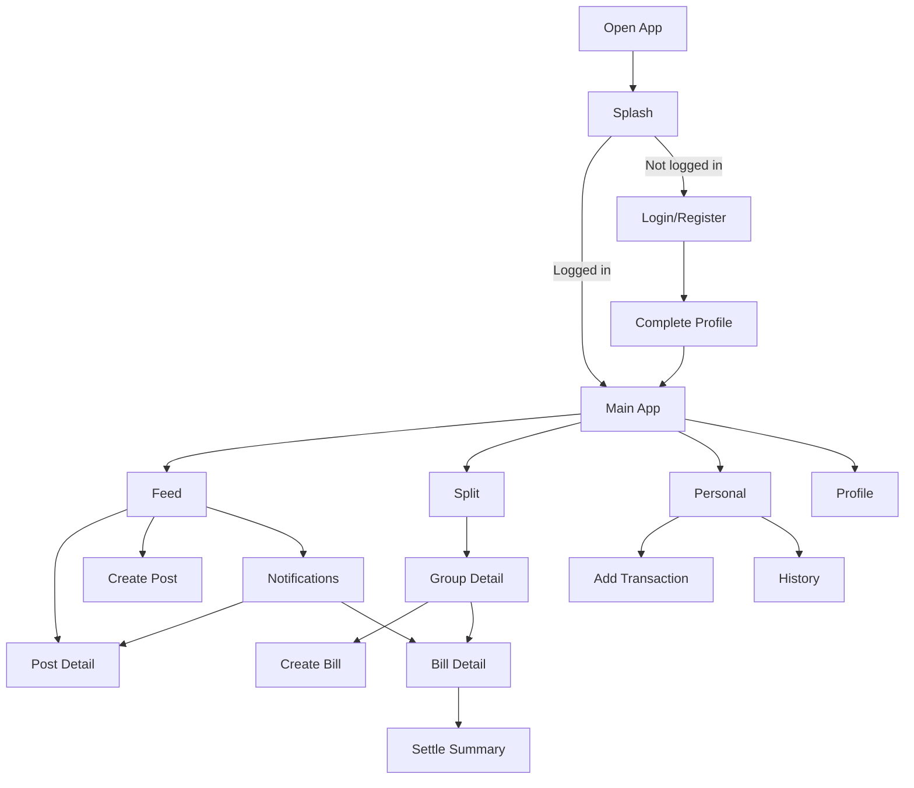

# App Flow v1 - DineSplit Social

## 1. Mục tiêu
Tài liệu mô tả flow tổng thể của app trước khi dựng navigation graph và wireframe.

## 2. First-time user flow
```text
Open App
  -> Splash
      -> if logged in: Main App (Feed tab)
      -> if not logged in: Login / Register

Login / Register
  -> Complete Profile (nếu user mới)
  -> Main App (Feed tab)
```

## 3. Main product loop
```text
Feed -> Split -> Personal -> Notification -> quay lại Feed
```

Ý nghĩa:
- Feed tạo ngữ cảnh xã hội
- Split xử lý chi phí nhóm phát sinh từ hoạt động ăn uống
- Personal phản ánh ảnh hưởng lên tài chính cá nhân
- Notification kéo user quay lại các hành động quan trọng

## 4. Core flow 1 - Authentication
```text
Splash
  -> Login
  -> Register
  -> Complete Profile
  -> Main App
```

## 5. Core flow 2 - Feed
```text
Feed Home
  -> Open Post Detail
      -> Like / Comment
  -> Create Post
      -> Publish
      -> Back to Feed Home
  -> Search
      -> Open Other User Profile / Post Detail
```

## 6. Core flow 3 - Personal Finance
```text
Personal Dashboard
  -> Add Transaction
      -> Save
      -> Back to Dashboard / History
  -> Transaction History
      -> Open Transaction Detail (optional in v1 skeleton)
```

## 7. Core flow 4 - Split Bill
```text
Group List
  -> Create Group
  -> Open Group Detail
      -> Create Bill
          -> Choose split method
          -> Review shares
          -> Save bill
      -> Open Bill Detail
          -> Update payment state
          -> View settle summary
```

## 8. Core flow 5 - Notifications
```text
Bell icon / Notification entry
  -> Notification List
      -> Open related Post / Bill / Personal screen
```

## 9. Core flow 6 - Assistant
```text
Assistant Entry
  -> Quick question chips
  -> Result card
  -> Deep link to related screen
```

## 10. Mermaid sơ đồ tổng quát

